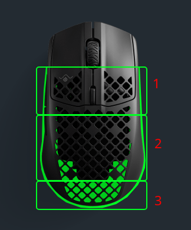
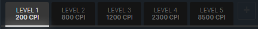

# [Aerox 3](https://steelseries.com/gaming-mice/aerox-3) Reverse Engineering Results

# Zones Scheme
This is the way I numbered them in [Colors](#colors) below

# Colors
### Zone 1
`21 01 ff 48 00 00 00 00 00 00 00`
### Zone 2
`21 02 00 00 00 ff 30 00 00 00 00`
### Zone 3
`21 04 00 00 00 00 00 00 ff 0f 00`

# LED Brightness
### Ilumination Disabled - 0
`23 00 00 00 00 00 00 00 00 00 00 00 00 00 00 00`
### 1/4
`23 0c 00 00 00 00 00 00 00 00 00 00 00 00 00 00`
### 2/4
`23 19 00 00 00 00 00 00 00 00 00 00 00 00 00 00`
### 3/4
`23 32 00 00 00 00 00 00 00 00 00 00 00 00 00 00`
### Full - 4/4
`23 64 00 00 00 00 00 00 00 00 00 00 00 00 00 00`

# Pooling Rate
### 1000ms
`2b 01 00 00 00 00 00 00 00 00 00 00 00 00 00 00`
### 500ms
`2b 02 00 00 00 00 00 00 00 00 00 00 00 00 00 00`
### 250ms
`2b 03 00 00 00 00 00 00 00 00 00 00 00 00 00 00`
### 125ms
`2b 04 00 00 00 00 00 00 00 00 00 00 00 00 00 00`

# DPI
Maximum 5 profiles are supported

DPI must be between 200-8500

### Example of setting 5 profiles, first mode is current

`2d 05 00 04 12 1b 34 c5 00 00 00 00 00 00 00 00`

### Anatomy of data sent

`2d NUMBER_OF_PROFILES CURRENT_PROFILE`

There must be at least one profile

CURRENT_PROFILE starts from 00 to 04

# Save (Probably)
It's being sent always after changing DPI, Pooling Rate etc. and clicking `Save` in engine
I'm asuming it's some kind of save command

`11 00 00 00 00 00 00 00 00 00 00 00 00 00 00 00`
